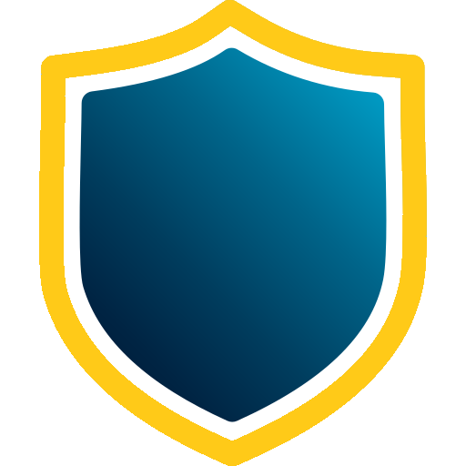
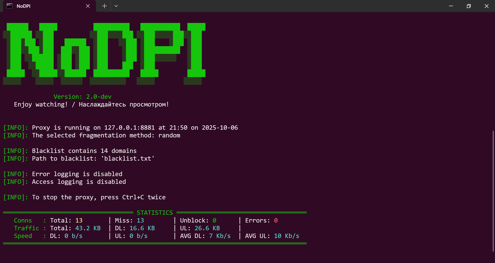

<div align="center">
  <p>
    <a href="#"></a>
  </p>
</div>

# NoDPI
<b><i>Say NO to blocking!</b></i>

[]()
[](https://www.gnu.org/licenses/gpl-3.0.txt)
[](https://github.com/GVCoder09/NoDPI)
[](https://github.com/remittor/zapret-openwrt/releases)
[](https://github.com/remittor/zapret-openwrt/releases)
[](https://github.com/GVCoder09/NoDPI)
[](https://github.com/GVCoder09/NoDPI)
[](https://github.com/GVCoder09/NoDPI)

> [!IMPORTANT]
> This project is a fork of the repository https://github.com/theo0x0/nodpi and is developed independently. Do not confuse with https://github.com/raspabamos/nodpi !

> [!NOTE]
> This version is for desktop systems. **The Android version is available here:** https://github.com/GVCoder09/NoDPI4Android

**Read this in other languages / Читайте на других языках**
- **[English](README.md)**
- [Русский](README.ru.md)

## Table of Content

- [NoDPI](#nodpi)
  - [Table of Content](#table-of-content)
  - [Description](#description)
    - [How does this work](#how-does-this-work)
    - [Key advantages and features](#key-advantages-and-features)
    - [Sites currently unavailable via NoDPI](#sites-currently-unavailable-via-nodpi)
    - [Alternatives](#alternatives)
  - [Terms of Use and Disclaimer](#terms-of-use-and-disclaimer)
  - [Quick start](#quick-start)
    - [Add to startup in Windows and Linux](#add-to-startup-in-windows-and-linux)
    - [Supported arguments](#supported-arguments)
  - [Run from source code](#run-from-source-code)
  - [Building the executable](#building-the-executable)
  - [Run in Docker](#run-in-docker)
  - [FAQ](#faq)
  - [Star History](#star-history)

## Description

 NoDPI is a utility designed to bypass DPI (Deep Packet Inspection). What is DPI? DPI is a technology for inspecting network packets based on their content to regulate and filter traffic. It is often used by internet service providers to censor and block access to certain web resources and protocols. The goal of this program is to "trick" DPI by modifying network packets, although in reality, this trickery is often simply a consequence of a lack of computing resources and time. 
 
 This utility was developed primarily for Russian users as a simpler (but less powerful) replacement for similar tools. In most cases, it gets the job done; in particular, it allows you to use YouTube without any problems.

 But unfortunately, the absolute performance of this utility cannot be guaranteed. Some sites, such as YouTube, are good to unlock, while others, as Instagram.com or Facebook.com, require completely different methods for bypassing locks, which are not yet implemented in this utility from their low-leveling and difficulty. Sometimes, the performance of certain sites can also depend on the provider - how it blocks the site and what technical means applies.

[]()

### How does this work

NoDPI launches a proxy server on your computer through which you direct http(s) traffic. The program intercepts ClientHello of outing connections and fragments them according to one of the following methods:

*Random fragmentation (by default)*

Clienthello is divided into several parts of random length. Each part is glued with the prefixes of the type of Clienthello and then all this is sent in one package.

*Fragmentation by SNI*

In the package there is a field containing SNI record. ClientHello is divided into 4 parts: to SNI, the first and second half of SNI, and all that is after it. The title indicating the type Clienthello is attached to each part and then all this is sent in one bag.

Also regardless of the method, the TLS version is replaced by version 1.3, which is the most modern (but this does not mean that your data begins to be transmitted according to the specifications of this version). All this together allows you to get around the lock. Apparently DPI does not yet have the necessary capacities to unravel this "ball" and simply ignore such traffic, saving time and effort. But it is possible that soon these methods will not be workers.

> [!IMPORTANT]
> NoDPI only works with HTTPS traffic. He can also take HTTP traffic, but purely for compatibility - sites working through this outdated protocol are practically not subject to unlock and the program simply sends traffic to the addressee.

NoDPI does not collect and does not send any data about you, does not use any third -party programs and libraries, does not interfere in the system processes and does not require administrator rights to work.

The entire NoDPI code is written exclusively on the Python and uses only its standard library.

### Key advantages and features

- Open source
- Easy to use, launch, and configure. The program has an intuitive interface. Using the utility requires no special knowledge; it can be launched by any user without administrator rights.
- The program works with a list of blocked domains and can automatically detect blocked websites.
- Cross-platform support ensures stable operation on Windows/Linux/MacOS. An Android version is also [available](https://github.com/gvcoder09/nodpi4android).
- The program can be integrated into a corporate network and used by staff, rather than just an individual.
- Supports error and access logging. You can see who visited specific websites and when.
- Ability to add yourself to autostart on Windows/Linux

### Sites currently unavailable via NoDPI

As of October 2025, Instagram and Facebook were not unlockable with NoDPI. Please use [GoodbyeDPI](https://github.com/ValdikSS/GoodbyeDPI) by @ValdikSS. All sites blocked by IP address are also unavailable.

### Alternatives

- **[GoodbyeDPI](https://github.com/ValdikSS/GoodbyeDPI)** by @ValdikSS (for Windows)
- **[zapret](https://github.com/bol-van/zapret)** by @bol-van (for MacOS, Linux and Windows)
- **[Green Tunnel](https://github.com/SadeghHayeri/GreenTunnel)** by @SadeghHayeri (for MacOS, Linux and Windows)
- **[DPI Tunnel CLI](https://github.com/nomoresat/DPITunnel-cli)** by @zhenyolka (for Linux and routers)
- **[DPI Tunnel for Android](https://github.com/nomoresat/DPITunnel-android)** by @zhenyolka (for Android)
- **[PowerTunnel](https://github.com/krlvm/PowerTunnel)** by @krlvm (for Windows, MacOS and Linux)
- **[PowerTunnel for Android](https://github.com/krlvm/PowerTunnel-Android)** by @krlvm (for Android)
- **[SpoofDPI](https://github.com/xvzc/SpoofDPI)** by @xvzc (for macOS and Linux)
- **[SpoofDPI-Platform](https://github.com/r3pr3ss10n/SpoofDPI-Platform)** by @r3pr3ss10n (for Android, macOS, Windows)
- **[GhosTCP](https://github.com/macronut/ghostcp)** by @macronut (for Windows)
- **[ByeDPI](https://github.com/hufrea/byedpi)** for Linux/Windows + **[ByeDPIAndroid](https://github.com/dovecoteescapee/ByeDPIAndroid/)** for Android (no root)
- **[youtubeUnblock](https://github.com/Waujito/youtubeUnblock/)** by @Waujito (for OpenWRT/Entware routers and Linux)

## Terms of Use and Disclaimer

> [!WARNING]
> By using this software in any form or distributing it, you accept the following terms of use and disclaimer

The developer and/or supplier of this software shall not be liable for any loss or damage, including but not limited to direct, indirect, incidental, punitive or consequential damages arising out of the use of or inability to use this software, even if the developer or supplier has been advised of the possibility of such damages.

The developer and/or supplier of this software shall not be liable for any legal consequences arising out of the use of this software. This includes, but is not limited to, violation of laws, rules or regulations, as well as any claims or suits arising out of the use of this software. The user is solely responsible for compliance with all applicable laws and regulations when using this software.

The developer and/or supplier of this software shall not be liable for any loss or damage arising out of the unauthorized use of this software. Unauthorized use includes, but is not limited to, using the software for illegal purposes, infringing copyrights, patents, trademarks or other intellectual property rights, or using the software in violation of the license terms of the software.

This software may not be used for illegal or unlawful purposes. Any use of the software for illegal activities, including but not limited to fraud, hacking, privacy violation, distribution of malware or any other actions contrary to the code and regulations is strictly prohibited. The user is fully responsible for any legal consequences arising from the use of this software for illegal purposes.

Your use of this software constitutes your agreement to the terms of this disclaimer. If you do not agree to these terms, you must stop using this software immediately.

## Quick start

1) Download the latest version for your OS from [the Releases page](https://github.com/GVCoder09/NoDPI/releases) and unzip it
2) Go to the directory with the unzipped utility and run it with the command `nodpi.exe --blacklist blacklist.txt` in Windows or `./nodpi --blacklist ./blacklist.txt` in Linux. You can replace the file `blacklist.txt` with your own file. **If the blacklist file is not specified, the program will search for the file `blacklist.txt` in the current directory by default.**
3) In the browser or system settings, set the proxy to 127.0.0.1:8881
4) Enjoy!

> [!IMPORTANT]
> Don't forget to disable the proxy in your system or browser settings after closing the program!

Please report any problems and malfunctions to us on [the Issues page](https://github.com/GVCoder09/NoDPI/issues)

### Add to startup in Windows and Linux

> [!NOTE]
> This option is only available in executable versions

1) Run the command `nodpi --install`. The program will be added to startup via the Windows registry (`HKEY_CURRENT_USER\Software\Microsoft\Windows\CurrentVersion\Run`) or via `~/config/autostart` in Linux
2) Restart your computer
3) Enjoy!

### Supported arguments

```
usage: nodpi [-h] [--host HOST] [--port PORT] [--out-host OUT_HOST] [--blacklist BLACKLIST | --no-blacklist | --autoblacklist]
               [--fragment-method {random,sni}] [--domain-matching {loose,strict}] [--log-access LOG_ACCESS] [--log-error LOG_ERROR]
               [-q] [--install | --uninstall]

options:
  -h, --help            show this help message and exit
  --host HOST           Proxy host
  --port PORT           Proxy port
  --out-host OUT_HOST   Outgoing proxy host
  --blacklist BLACKLIST
                        Path to blacklist file
  --no-blacklist        Use fragmentation for all domains
  --autoblacklist       Automatic detection of blocked domains
  --fragment-method {random,sni}
                        Fragmentation method (random by default)
  --domain-matching {loose,strict}
                        Domain matching mode (strict by default)
  --log-access LOG_ACCESS
                        Path to the access control log
  --log-error LOG_ERROR
                        Path to log file for errors
  -q, --quiet           Remove UI output
  --install             Add proxy to Windows/Linux autostart (only for executable version)
  --uninstall           Remove proxy from Windows/Linux autostart (only for executable version)
```

## Run from source code

1) Make sure you have Python 3.8 or higher installed. No third-party libraries are required
2) Clone the repository `git clone https://github.com/GVCoder09/NoDPI.git` or [download the archive](https://github.com/GVCoder09/NoDPI/archive/refs/heads/main.zip) with the source code and unzip it
3) Go to the main directory and run the code with the command `python src/main.py`
4) In the browser or system settings, set the proxy to 127.0.0.1:8881
5) Enjoy!

You can enable error or access logging using parameters `--log_error` and `--log_access`

## Building the executable

1) Make sure you have Python 3.8 or higher installed.
2) Install pyinstaller: `pip install pyinstaller`
3) Clone the repository `git clone https://github.com/GVCoder09/NoDPI.git` or [download the archive](https://github.com/GVCoder09/NoDPI/archive/refs/heads/main.zip) with the source code and unzip it
4) Go to the main directory and run the command `pyinstaller ./nodpi.spec`
5) The compiled file will be located in ist folder `./dist`

## Run in Docker

1) [Install Docker](https://docs.docker.com/).
2) Clone the repository: `git clone https://github.com/GVCoder09/NoDPI`
3) Navigate to the project directory and build the container: 
   ```bash
   cd NoDPI
   sudo docker build -t nodpi-proxy .
   ```
4) Run the container with the command: 
   ```bash
   sudo docker run -d \
    --name nodpi \
    -p 8881:8881 \
    -v $(pwd)/blacklist.txt:/tmp/nodpi/blacklist.txt \
    nodpi-proxy \
    --host 127.0.0.1 \
    --port 8881 \
    --blacklist /tmp/nodpi/blacklist.txt \
    --quiet
    ```
5) Enjoy!

## FAQ

*Q: Is using NoDPI legal in Russia?*

A: Yes, its usage is completely legal as of October 2025. However, you can be held administratively liable for advertising and distributing tools designed to circumvent blocking.

*Q: Is it safe?*

A: Yes, using this utility is safe. All traffic sent over HTTPS remains encrypted as it was before. Furthermore, we do not collect any user information.

*Q: Does this program mask my traffic? Can my ISP not see which sites I visit?*

A: No. Unlike a VPN or Tor, this program does not hide your traffic from your Internet Service Provider (ISP). Your ISP can still see the IP addresses of the websites you connect to.

## Star History

[](https://www.star-history.com/#GVCoder09/NoDPI&Date)